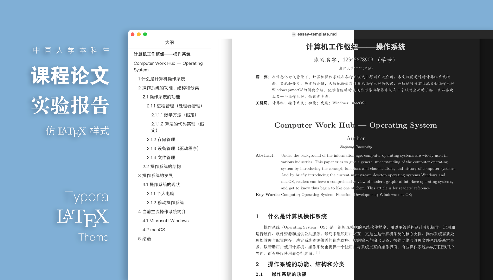

# Typora伪装LaTeX中文样式主题

本项目的初衷是为了简化中国大陆本科生**小型通识课论文**（或**实验报告**）撰写的负担。这里基本采用了浙江大学要求的格式（字体较小，页边距较小），但大部分同学都可以自行在css中修改适合自己学校的格式。

markdown的轻量化特性，使您可以专注于论文内容而不用担心格式。书写时仅通过简单的标记，并通过替换样例模板中的个人信息，您就可以输出媲美卷王由LaTeX​排版的精美论文与报告。

这是一个Typora的markdown主题样式，该主题理论上适用于所有平台，CSS也适用于部分其他编辑器。macOS和Windows中的个别特性可能不同。

## 预览

（较完整的论文预览见这里: [点我😀](https://blog.keldos.me/2021/05/md-latex-template/)；如果GitHub中的图像加载不出来，您也可以查看[我博客上的说明](https://blog.keldos.me/2021/05/typora-latex-css/)。）

### 封面，摘要和关键词

| ||
| :----: | :----: |

### 预览与编写

| ||
| :----: | :----: |
| ||

#### 层级标题 

|||
| :----: | :----: |

```markdown
层级标题：

### 标题3

#### 标题4

##### 标题5

###### 标题6
```

#### 表格 
|||
| :----: | :----: |

```markdown
表格：

<center><strong>表 2  全球/中国桌面操作系统市场份额占比（%）</strong></center>

| OS   | Windows | macOS | Unknown | Linux | Chrome OS | 其他 |
| ---- | ------- | ----- | ------- | ----- | --------- | ---- |
| 全球 | 76.56   | 17.1  | 2.68    | 1.93  | 1.72      | 0.01 |
| 中国 | 87.55   | 5.44  | 6.24    | 0.75  | 0.01      | 0.01 |
```

#### 项目列表
|||
| :----: | :----: |

```markdown
项目列表：

1.  有序列表项
2.   有序列表项2
    +   无序列表项1
    +   无序列表项2. 
        *   [x] 表示已完成。 ***==(请尽量不要使用此功能，因为它的对齐效果不佳)==***
        *   [ ] 表示未完成。

*   项目1 
    *   项目2 
        *   项目3 

1. 项目1 
2. 项目2 
    1. 项目2.1 
    2. 项目2.2 
        1. 项目2.2.1 
        2. 项目2.2.2
```

#### 代码块 
|||
| :----: | :----: |

```markdown
代码块

​```html

<!DOCTYPE html>
<html>
<body>

<h1>The *= Operator</h1>

<p id="demo"></p>

<script>
var x = 10;
x *= 5;
document.getElementById("demo").innerHTML = x;
</script>

</body>
</html>
​```
```

#### Mermaid
|||
| :----: | :----: |

```markdown
mermaid 图形

​```mermaid
graph LR
A(开始) -->
input[/输入a,b/] --> if{a%b=0 ?}
if --->|yes| f1[GCD = b] --> B(结束)
if --->|no| f2["a, b = b, a % b "]-->if
​```
```

#### 公式

|||
| :----: | :----: |

```markdown
公式:

$$
\iint\limits_{x^2 + y^2 \leq R^2} f(x,y)\,\mathrm{d}x\,\mathrm{d}y = \int_{\theta=0}^{2\pi} \mathrm{d}\theta\int_{r=0}^R f(r\cos\theta,r\sin\theta) r\,\mathrm{d}r\, \tag{1}
$$
```

#### 其他

还有支持其他语法特性功能，这里不再展示，请参考Typora的语法库。

## 安装

*   安装前，请确保您已经安装Typora或其他markdown编辑器（也可以用某些IDLE），并拥有基本的markdown语法知识；

    *   [如果您没有](#什么是typora)

*   最简单的安装办法是在该GitHub页面的右侧找到最新的（或较早的正式版）release，然后下载`Source code (zip)`；
    release中包含了单独的`.css`样式文件，如果您不需要字体文件和样例文件，可以仅下载它们，这会大大减小下载大小。
    
    *   当然你也可以使用命令行下载最新的打包代码（虽然没用，只是可能酷一点？）：
    
    ```bash
    $ cd <你常用的下载文件夹>
    $ git clone https://github.com/Keldos-Li/typora-latex-theme.git
    ```
    
*   解压这个文件，然后将`css`文件夹中的`latex.css`和`latex-dark.css`两个文件复制到你的Typora主题文件夹下；

*   打开`/Supplemental/Fonts`文件夹，安装需要的字体；

*   启动或重新启动Typora，然后从主题菜单中选择`Latex`或`Latex Dark`选项。

## 使用

*   在Typora的`偏好设置` – `Markdown` 中选取`保留连续的空格与单个换行` *（如果您不希望您的论文有段后的额外行距的话）*；
*   按照您学校的要求修改css文件；[（为什么？）](#为什么要修改css文件)

    *   修改CSS后请重新启动Typora以查看效果

*   `Supplemental`文件夹中的`essay-template.md`和`essay-template.pdf`展示了一篇小论文在该主题下的效果（其中文字来源于我本人的课程作业以及一些拼凑，请不要在意过多细节），其中论文封面（也单独放置在`cover-template.md`文件中）、摘要、关键词和其他一些特别的元素使用HTML代码来编写。您可以自行取用修改它们的文字内容部分和代码部分来完成您的课程论文。
    *   如果您看不懂HTML代码，请先自行百度/谷歌/必应，然后尝试联系您在计算机系的同学；
    
*   如果可以的话，或许您可以在论文致谢中提到这个项目。(/ω＼)

　　这本质是一个适用于所有markdown编辑器的CSS样式（但对Typora编辑器做了额外的优化），您也可以将其用于其他您喜欢的markdown编辑器的自定义样式（尚未经过完整测试）。

### 特别注意

*   PDF页面**页边距**：

    在Windos/Linux中，您可以很好地使用

    ```css
    @media print{
      @page{
        margin: 1.8cm 2cm 1.2cm 2cm !important; 
        /* 按次序为 上 右 下 左 的页边距 */
      }
    }
    ```

    来更改打印PDF的页边距。
    
    但对于macOS用户，因为[Typora本身的问题](https://github.com/typora/typora-issues/issues/998)，暂时不能使用这一方法调整页边距。
    
    *   可以在Typora的导出设置里重新设置自定义页边距。
    *   或先导出为html，然后在Chrome中打开打印。
        （不能用Safari！Safari会自行设置最小边距而且非常不合理，这会导致您无法精确控制页边距；另一方面，在某次更新后Safari取消了对CSS本地字体读取的支持（理由是隐私问题），会导致您无法显示很多字体！）
    *   或者直接用pandoc的命令行设置。

*   **超链接**：

    显然，我们不希望打印的论文存在蓝色的超链接（？），我在CSS中修改了部分代码，使得在页面编辑和导出html预览中可以得到正常的超链接样式，但打印时会取消颜色和下划线（仍可以点击链接）。

    不知道大家是否有这个需求，如果有更合适的方法可以联系我。

*   **多级列表**：

    因为我的技术原因，请暂时不要在**二级有序列表**之后**混用** *有序列表* 和 *无序列表* 以及*核对清单*，会出现一些bug。（虽然感觉会这么干的人应该不多。）如果您有解决方案，请联系我。

*   **页眉和页脚**：

    目前似乎不能直接定义，请在Typora的导出设置里设置好您需要的页眉和页脚文字，导出后在PDF编辑器中调整您喜欢的样式风格。

*   **引用参考文献**

    目前没有更好的方式，请您主动编号……（或许小型课程论文不需要大量参考文献。）

*   **专注模式**和**打字机模式**：

    还没写这部分的代码。本主题样式初衷不在于此，如果您有需求，可以提交issue或进入讨论区讨论，我视需求和精力再进行开发。

## Q&A

### 什么是**Typora**？

[Typora](https://typora.io/)是一个超级好用的实时预览markdown编辑器；

### 什么是**markdown**？

[markdown](https://daringfireball.net/projects/markdown/) 是一种轻量级标记语言，用于使用纯文本创建格式化文本。
约翰·格鲁伯和亚伦·斯沃茨于2004年创建了Markdown，作为一种以源代码形式吸引人类读者的标记语言。
Markdown排版语法简洁，让人们更多地关注内容本身而非排版。它可与HTML混编，可导出 HTML、PDF 以及本身的 .md 格式等文件。
Markdown广泛用于博客、即时消息、在线论坛、协作软件、文档页面和阅读文件。

参考：

*    [Markdown中文语法简介](https://markdown.com.cn/)
*    [Typora使用的markdown语法参考](https://support.typora.io/Markdown-Reference/)

### 怎么找到Typora主题文件夹？

*   从`文件` – `偏好设置`中打开设置面板，然后单击“打开主题文件夹”即可。

*   如果您需要手动打开，对于Windows/Linux，这个文件夹一般是`C:\Users\{username}\AppData\Roaming\Typora\themes\`；对于macOS，这个文件夹一般是`/Users/{username}/Library/Application Support/abnerworks.Typora/themes/`。

### 该主题都包含了哪些字体？

这里会列出所有我使用的字体，它们都存放在`/Supplemental/Fonts`文件夹。

*   `Latin Modern`文件夹存放了常规$LaTeX$文档使用的英文字体 **Latin Modern**，请所有用户安装。（大家都会喜欢这个字体的，文件也不是很大，所以安装吧，就不把它们放在主题文件夹下再import了。~~绝不是因为我懒~~）；

*   其他文件夹存放了一些中文字体和代码字体，可以选择性安装（特别是如果您已经拥有其中的一些字体的话）。中文字体文件较大，请解压后安装。请注意，如果您**不拥有这些字体**也**不希望安装**的话，请到CSS文件中自行更改选用的字体（本项目没有写太多字体回退机制）；

    其中包含：
    *   `FZFS_Document.TTF`  **方正公文仿宋**  © Beijing Founder Electronics Co.,Ltd. 北京北大方正电子有限公司

    *   `FZHT_Document.TTF`  **方正公文黑体**  © Beijing Founder Electronics Co.,Ltd. 北京北大方正电子有限公司

    *   `FZKT_Document.TTF`  **方正公文楷体**  © Beijing Founder Electronics Co.,Ltd. 北京北大方正电子有限公司

        *选用方正的这个系列字体，是因为它们已经存在粗体效果，可以直接应用为标题字体而跳过Typora的伪粗体机制。*

    *   `Kaiti.ttc`  **华文楷体**  © 1991-1998, Changzhou SinoType Technology Co., Ltd. All rights reserved.　 常州华文印刷新技术有限公司

    *   `STFANGSO.ttf`  **华文仿宋**  © 1991-1998, Changzhou SinoType Technology Co., Ltd. All rights reserved. 常州华文印刷新技术有限公司

    *   `STHeitiBold.ttf`  **华文黑体Bold**  © 2018, Changzhou SinoType Technology Co., Ltd.. All rights reserved. 常州华文文字技术有限公司

        *这比普通的华文黑体更黑。该字体被用于小标题样式 (heading) 。*

    *   `Songti.ttc`  **宋体-简**  © 2010-2012, Changzhou SinoType Technology Co., Ltd. All rights reserved. 常州华文印刷新技术有限公司

        *请检查您电脑中原先安装的宋体是否与本字体相同。该系列名称“**宋体-简**”的为字体系列包含了**常规体**、**细体**、**粗体**、**黑体**共4个字重字体。*

    *   `PingFang.ttc`  **苹方-简** \& **苹方-繁** \& **苹方-港**  Designed by DynaComware & Apple.

        *共三个字体系列的字体集，每个字体系列又各包含从**极细体**到**中粗体**的6个字重字体。*

    *   `SF-Mono-Regular.otf` `SF-Mono-Bold.otf` `SF-Mono-RegularItalic.otf` `SF-Mono-BoldItalic.otf`  **SF Mono**  Apple Inc.

        ***该Apple系统字体不被授权应用在除Xcode, Terminal.app和Console.app的其他任何应用程序上，此处分发仅用于学习目的，请在下载后24小时内删除。***

*   如果您选用自己的其他字体，请尽量使用有完整字体系列的字体集作为正文字体，在CSS中写入时尽量**填写字体系列名称而非PostScript名称**（除非您希望固定使用单一字重与字体风格），使markdown可以通过您书写时的标记自动选取使用的字体。对于中文字体，一个完整的字体系列应该包括：常规体（regular）、粗体（bold），如果您希望粗体风格更强，它应当还包含黑体（Heavy）。

*   **所有的字体文件请自行获取授权**，本人不对您使用字体造成的法律纠纷负责。

### 为什么要修改CSS文件？

每个学校所要求的格式略有不同，尽管老师不会肉眼查看您的格式是否符合要求，但或许您为了自己的需要仍需要稍作修改，例如加大字体、行间距和页边距使得论文的页数显得更长。

尽管Typora不希望您直接编辑您下载的主题文件，但我暂时推荐您**直接修改**我们的样式文件，得以充分达到自定义的效果，我为此写了大量的注释。

*   在当前版本中设置点较为分散，我后期应该会将设置点整合到`:root`设置中，届时您将可以直接在css样式表的最顶端修改。但目前，您不得不记住所有您更改过的位置，并在获取我们之后的更新后重新修改一遍（对不起！🙇🏻）

#### 我该如何修改CSS文件？

*   确保您电脑中拥有**文本编辑软件**，如*记事本*（Windows）或*文本编辑*（macOS），如果有代码编辑软件就更好了。如果双击CSS文件无法打开，请在系统让您选取程序时选取上述软件；
    *   *绝对不要用Microsoft Word打开它！！！就算它可以！*
*   根据代码中的注释提示修改源代码中样式选择器的变量取值；

*   如果您看不懂注释，或不知道修改代码会造成什么效果，请先自行百度/谷歌/必应，然后尝试联系我。

## 反馈

*   在 GitHub Issues [报告Bug](https://github.com/Keldos-Li/typora-latex-theme/issues/new?labels=bug)。
*   在 GitHub [请求新的功能](https://github.com/Keldos-Li/typora-latex-theme/issues/new?labels=Feature+Request)。
*   联系[我本人](mailto:i@keldos.me)。

## 说明

本人呢，本来是打算自己用的，所以Latin modern字体文件都直接安装引用了_(:з」∠)\_。
相比原作者的代码，**其他部分各种部分都重新编写了一点，修改了一点。**\_(:з」∠)\_
主要改动在于：

- 修订了部分mermaid样式；
- 修改了页面边框样式；
- 增订了较为完整的黑色模式；
- 修改了多级列表编号样式（有一定bug）；
- 增加了代码块字体和代码块样式；
- 修改了表格样式；
- 修改了字体样式；
- 整理了代码编写风格使其更美观；
- 增订了大部分注释；（当然我写得很随意啦啦啦）
- 增加了侧边栏字体修改等；
- 其他细节修改。

已知的bug: 

- 无编号项目列表有很大的bug！！在二级项目之后，你不能混用有序列表和无序列表！因为全都是重新定义的content，我不能理解它为什么会对子项目产生影响！！可恶！
- 当行间代码太长跨页的时候好像也会有点问题，到时候再改……
- mermaid字体无法修改，我找遍了mermaid的最新文档和Typora的其他样式资源都没找到这个应该怎么在CSS样式表里修改……呜呜呜。

未来的预期的话我应该会搞成前导root定义统一颜色字体字号啥最后引用的，同时加入定义CSS完成摘要和关键词的定制。现在的代码就是东拼西凑的，最后肯定需要整合重构的。
*（具体时间不确定。。）*

>   虽然是都开源项目，但这个项目似乎经过三手每个人都重新做了仓库而不是fork😂，不过确实每经一次手都有很多深化和改进orz，感觉目前代码已经没有办法merge了，害。感觉不是很符合开源精神。有点对不起原作者的感觉🥲（虽然我们谈过话）。

*   This theme for Typora is built on Mac, with Typora version 0.10.10 (5354).

## 鸣谢

该项目最初来自于知乎作者 @让幻想飞 （清华大佬，没想到和我一样年轻，但可能不喜欢及时回消息\_(:з」∠)\_）

他的原注释：

> 这篇样式基于知乎大佬LAN DU的样式，
>
> 原文知乎链接：https://zhuanlan.zhihu.com/p/158767474
>
> GitHub链接：
> https://github.com/du33169/typora-theme-essay_cn
>
> 主要改动：
>
>  - 适配LaTeX的字体。选用像LaTeX的字体是装“哔”的重要手段。
>
>  - 更改标题、目录和大纲的编号样式。改成1. ，1.1 ， 1.1.1 ，……这样的编号更有一种浓厚的论文感觉。
>
>  - 二级及以下标题全部靠左，适应文章样式。后面加上大空白，适配LaTeX样式
>     
>  不足之处：
>     
>  - 仍然无法添加页眉页脚。
>     适用于小论文、实验报告等对格式要求较松的情况，在不写代码的前提下装“哔”

@让幻想飞 的**知乎文章地址**：https://zhuanlan.zhihu.com/p/357096043

**GitHub项目地址**: https://github.com/yfzhao20/Typora-markdown
